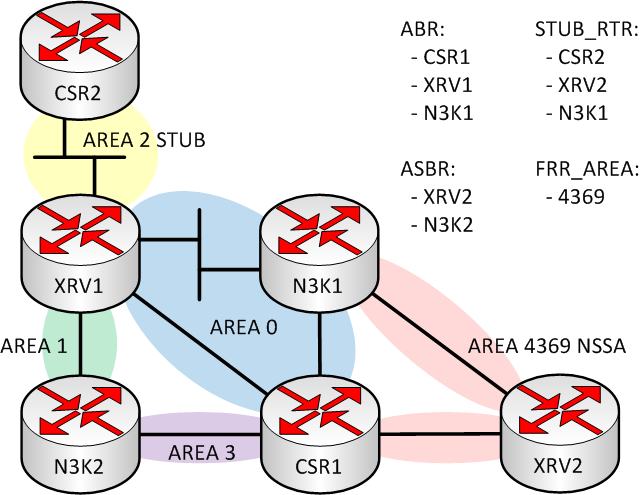

# Continuous Integration (CI) pipeline
This project is automatically tested using [Travis CI](https://travis-ci.org)
using the file `.travis.yml` in the previous directory. CI testing spans
three distinct stages in this project:

  1. [Linting code](#linting-code)
  2. [Unit tests](#unit-tests)
  3. [Playbook tests](#playbook-tests)

## Stage 1: Linting code
All source code is linted before any code is actively executed. The
file `tests/lint.sh` is a bash script which checks all YAML, Python, and
markdown files for syntax and styling issues. Additionally, static code
analysis is applied to Python code to identify any security issues before
execution.

## Stage 2: Unit tests
All custom Python filters (which are individual, independent functions) are
tested next. The `tests/tasks` directory contains an Ansible task list for
each function. These are the parsers used to transform CLI output (text)
from the network devices into structured data. Each test displays the
structured data to stdout as JSON for troubleshooting and human validation.

### Running tests
The playbook called `tests/unittest_playbook.yml` automatically includes
these task lists for execution. The tests are kept simple using static text
input with bogus values to ensure the parsers function correctly.

### Targeted testing
If you only want to run a subset of unit tests, you can override the `TASKS`
variable from the CLI using `-e` or `--extra-vars`. For example, to only test
the IOS OSPF neighbor functionality, use this command:

`ansible-playbook unittest_playbook.yml -e "TASKS=test_ios_ospf_neighbor.yml"`

Since this string is a regex, quantifiers are supported. For example, to only
test IOS-XR related filters, use this command:

`ansible-playbook unittest_playbook.yml -e "TASKS=test_iosxr*"`

## Stage 3: Playbook tests
Test the entire playbook for all supported platforms using mock data
to simulate virtual devices. This is a faster and lower cost way to test
the playbook compared to spinning up virtual devices. The test topology
below is used.

### Mock device output
The `tests/vars/` directory contains an Ansible variables file in the
format `mock_{{ inventory_hostname }}.yml` which represents a specific
host within the test topology. This fabricated data matches what is defined
in the `hosts.yml` and `group_vars/` files so that the tests pass. In
summary, the host/group variables identify what "right looks like", the mock
data has been written to be "right", and the diagram shows the full topology.
All three pieces of information are telling the sames tory.

### Running tests
The easiest way to manually run this test is to issue the command:

`ansible-playbook nots_playbook.yml -e "ci_test=true"`

This overrides the `ci_test` default value of `false` to `true`, which skips
the network device data collection tasks. Instead, it loads the mock data
defined previously, and continues on with the playbook as normal.
Users can also modify the `ci_test` variable to `true` in `hosts.yml` if
there is active development without any virtual routers.
